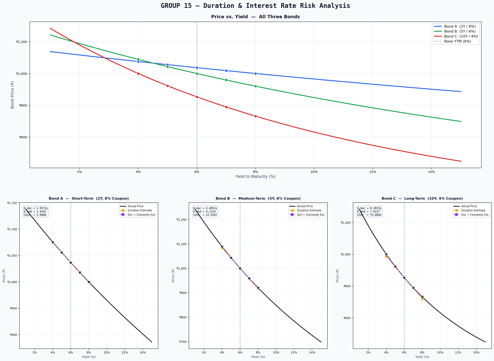

<div align="center">

# 📊 Duration & Interest Rate Risk — Bond Simulations

### GROUP 15 · Financial Modeling Course Project

[](https://python.org)
[](https://numpy.org)
[](https://matplotlib.org)

---

*A comprehensive quantitative analysis of bond price sensitivity to yield changes using Duration (first-order) and Convexity (second-order) approximations, simulated across three bonds with different maturities and coupon structures.*

</div>

---

## Table of Contents

- [Overview](#overview)
- [Bond Portfolio](#bond-portfolio)
- [Mathematical Framework](#mathematical-framework)
  - [Bond Pricing](#1-bond-pricing)
  - [Macaulay Duration](#2-macaulay-duration)
  - [Modified Duration](#3-modified-duration)
  - [Convexity](#4-convexity)
  - [Price Change Approximations](#5-price-change-approximations)
- [Code Architecture](#code-architecture)
  - [Core Functions](#core-functions)
  - [Simulation Engine](#simulation-engine)
  - [Visualization Pipeline](#visualization-pipeline)
- [Getting Started](#getting-started)
- [Output](#output)
  - [Console Output](#console-output)
  - [Generated Graphs](#generated-graphs)
- [Results & Analysis](#results--analysis)

---

## Overview

This project investigates **interest rate risk** — the risk that changes in market yields will affect bond prices. We implement the core fixed-income analytics from scratch (no financial libraries) and compare two approximation approaches against exact mathematical pricing:

| Approach | Order | Captures |
|----------|:-----:|----------|
| **Duration-only** | 1st (Linear) | Slope of price-yield curve at base YTM |
| **Duration + Convexity** | 2nd (Quadratic) | Slope **and** curvature of price-yield curve |

The simulation applies yield shocks of **±1%** and **±2%** to a base YTM of **6%** and quantifies the approximation error for each method.

---

## Bond Portfolio

All bonds share a **Face Value (FV) = ₹1,000** and are evaluated at a **Base YTM = 6%**.

| Bond | Category | Maturity (n) | Coupon Rate (c) | Annual Coupon (C) | Pricing Relationship |
|:----:|----------|:------------:|:---------------:|:-----------------:|:--------------------:|
| **A** | Short-Term | 2 years | 8% | ₹80 | Premium (c > YTM) |
| **B** | Medium-Term | 5 years | 6% | ₹60 | Par (c = YTM) |
| **C** | Long-Term | 10 years | 4% | ₹40 | Discount (c < YTM) |

> **Note:** Bond A trades at a **premium** because its coupon (8%) exceeds the market yield (6%). Bond B trades at **par** because its coupon equals the yield. Bond C trades at a **discount** because its coupon (4%) is below the yield.

---

## Mathematical Framework

### 1. Bond Pricing

The price of a bond is the **present value of all future cash flows** — periodic coupon payments and the face value at maturity:

$$P = \sum_{t=1}^{n} \frac{C}{(1 + y)^{t}} + \frac{FV}{(1 + y)^{n}}$$

Where:
- $P$ = Bond price (present value)
- $C$ = Annual coupon payment = $FV \times c$
- $y$ = Yield to Maturity (YTM)
- $n$ = Number of years to maturity
- $FV$ = Face value (₹1,000)

**Implementation** → [`bond_price()`](simulation.py#L24-L42)

```python
def bond_price(face_value, coupon_rate, ytm, maturity):
    coupon = face_value * coupon_rate
    price = 0.0
    for t in range(1, maturity + 1):
        price += coupon / (1 + ytm) ** t
    price += face_value / (1 + ytm) ** maturity
    return price
```

---

### 2. Macaulay Duration

Macaulay Duration is the **weighted average time** until a bondholder receives the bond's cash flows, where weights are the present values of the individual cash flows:

$$D_{\text{mac}} = \frac{1}{P} \sum_{t=1}^{n} \frac{t \times CF_{t}}{(1 + y)^{t}}$$

Where:
- $CF_t$ = Cash flow at time $t$ (coupon for $t < n$; coupon + face value for $t = n$)
- $P$ = Current bond price
- $t$ = Time period (in years)

**Interpretation:** A Macaulay Duration of 4.47 years means the weighted-average time to receive all cash flows is 4.47 years.

**Implementation** → [`macaulay_duration()`](simulation.py#L45-L60)

```python
def macaulay_duration(face_value, coupon_rate, ytm, maturity):
    coupon = face_value * coupon_rate
    price  = bond_price(face_value, coupon_rate, ytm, maturity)
    weighted_sum = 0.0
    for t in range(1, maturity + 1):
        cf = coupon if t < maturity else coupon + face_value
        weighted_sum += t * cf / (1 + ytm) ** t
    return weighted_sum / price
```

---

### 3. Modified Duration

Modified Duration adjusts Macaulay Duration for the compounding effect and gives the **percentage change in bond price for a 1% change in yield**:

$$D_{\text{mod}} = \frac{D_{\text{mac}}}{1 + y}$$

**Interpretation:** A Modified Duration of 7.81 means that for a 1% increase in yield, the bond price drops by approximately **7.81%**.

**Implementation** → [`modified_duration()`](simulation.py#L63-L72)

```python
def modified_duration(face_value, coupon_rate, ytm, maturity):
    d_mac = macaulay_duration(face_value, coupon_rate, ytm, maturity)
    return d_mac / (1 + ytm)
```

---

### 4. Convexity

Convexity measures the **curvature** (second derivative) of the price-yield relationship. It captures the non-linear behavior that duration alone misses:

$$\text{Convexity} = \frac{1}{P \times (1 + y)^{2}} \sum_{t=1}^{n} \frac{t(t+1) \times CF_{t}}{(1 + y)^{t}}$$

Where:
- $t(t+1)$ = The second-derivative weighting factor
- All other terms are as defined above

**Interpretation:** Higher convexity means the bond's price-yield curve bends more, making duration-only estimates increasingly inaccurate for large yield changes.

**Implementation** → [`convexity()`](simulation.py#L75-L94)

```python
def convexity(face_value, coupon_rate, ytm, maturity):
    coupon = face_value * coupon_rate
    price  = bond_price(face_value, coupon_rate, ytm, maturity)
    conv_sum = 0.0
    for t in range(1, maturity + 1):
        cf = coupon if t < maturity else coupon + face_value
        conv_sum += t * (t + 1) * cf / (1 + ytm) ** t
    return conv_sum / (price * (1 + ytm) ** 2)
```

---

### 5. Price Change Approximations

#### Method 1 — Duration Only (Linear / First-Order)

Uses a **Taylor series first-order expansion** around the base yield:

$$\Delta P \approx -D_{\text{mod}} \times P \times \Delta y$$

This is a **linear approximation** — it assumes the price-yield curve is a straight line (tangent at the base YTM). Accuracy degrades for large yield shifts.

**Implementation** → [`duration_estimate()`](simulation.py#L101-L108)

```python
def duration_estimate(price, d_mod, delta_y):
    delta_p = -d_mod * price * delta_y
    return price + delta_p
```

#### Method 2 — Duration + Convexity (Quadratic / Second-Order)

Adds the **second-order convexity correction** term:

$$\Delta P \approx -D_{\text{mod}} \times P \times \Delta y + \frac{1}{2} \times \text{Convexity} \times P \times (\Delta y)^{2}$$

This is a **quadratic approximation** — it accounts for the curvature of the price-yield curve and is significantly more accurate for large yield changes.

**Implementation** → [`duration_convexity_estimate()`](simulation.py#L111-L118)

```python
def duration_convexity_estimate(price, d_mod, conv, delta_y):
    delta_p = (-d_mod * price * delta_y) + (0.5 * conv * price * delta_y ** 2)
    return price + delta_p
```

---

## Code Architecture

### Core Functions

| Function | Purpose | Inputs | Output |
|----------|---------|--------|--------|
| `bond_price()` | Present value of all cash flows | FV, coupon rate, YTM, maturity | Price (₹) |
| `macaulay_duration()` | Weighted-average time to cash flows | FV, coupon rate, YTM, maturity | Duration (years) |
| `modified_duration()` | Price sensitivity per unit yield change | FV, coupon rate, YTM, maturity | Modified Duration |
| `convexity()` | Curvature of price-yield relationship | FV, coupon rate, YTM, maturity | Convexity |
| `duration_estimate()` | Linear price approximation | Price, D_mod, Δy | Estimated Price (₹) |
| `duration_convexity_estimate()` | Quadratic price approximation | Price, D_mod, Conv, Δy | Estimated Price (₹) |

### Simulation Engine

The [`simulate_bond()`](simulation.py#L125-L195) function orchestrates the full analysis for each bond:

```
simulate_bond()
├── Compute base metrics (Price, D_mac, D_mod, Convexity)
├── For each yield shock (Δy ∈ {-2%, -1%, 0%, +1%, +2%}):
│   ├── Table A: Actual price via bond_price()
│   ├── Table B: Duration-only estimate via duration_estimate()
│   └── Table C: Duration+Convexity estimate via duration_convexity_estimate()
├── Calculate approximation errors (Estimated − Actual)
└── Return results dictionary for plotting
```

### Visualization Pipeline

The plotting section ([lines 233–381](simulation.py#L233-L381)) generates four publication-quality graphs:

```
Figure Layout (20 × 15 inches)
┌──────────────────────────────────────────────┐
│       Price vs. Yield — All Three Bonds      │  ← Graph 1: Overlay comparison
│       (Full-width, smooth curves + markers)  │
├──────────────┬───────────────┬───────────────┤
│  Bond A (2Y) │  Bond B (5Y)  │  Bond C (10Y) │  ← Graphs 2–4: Per-bond
│  Actual vs.  │  Actual vs.   │  Actual vs.   │     approximation comparison
│  Estimates   │  Estimates    │  Estimates    │
└──────────────┴───────────────┴───────────────┘
```

**Color Scheme:**

| Element | Color | Hex |
|---------|-------|-----|
| Bond A (Short-Term, 2Y) | 🔵 Blue | `#2563EB` |
| Bond B (Medium-Term, 5Y) | 🟢 Green | `#16A34A` |
| Bond C (Long-Term, 10Y) | 🔴 Red | `#DC2626` |
| Actual Price Curve | ⚫ Dark | `#1e1e2e` |
| Duration Estimate | 🟡 Amber | `#f59e0b` |
| Convexity Estimate | 🟣 Violet | `#7c3aed` |

---

## Getting Started

### Prerequisites

- **Python 3.10+**
- **NumPy** — numerical computations
- **Matplotlib** — graph generation

### Installation

```bash
# Clone the repository
git clone https://github.com/<your-username>/FinancialModeling.git
cd FinancialModeling

# Option A: Using Anaconda (recommended)
conda activate base
# NumPy and Matplotlib come pre-installed with Anaconda

# Option B: Using pip
pip install numpy matplotlib
```

### Run

```bash
python simulation.py
```

**What happens:**
1. Three bonds are simulated with yield shocks of ±1% and ±2%
2. Formatted tables are printed to the console (Tables A, B, C per bond)
3. A composite graph is saved as `bond_analysis_graphs.png`
4. The graph is displayed interactively via `plt.show()`

---

## Output

### Console Output

For each bond, the simulation prints three tables:

| Table | Contents | Purpose |
|:-----:|----------|---------|
| **A** | Actual mathematical price at each yield | Ground truth — computed via `bond_price()` |
| **B** | Duration-only estimate + error | Shows linear approximation accuracy |
| **C** | Duration + Convexity estimate + error | Shows quadratic approximation accuracy |

<details>
<summary><b>📋 Click to expand sample console output</b></summary>

```
█████████████████████████████████████████████████████████████████
  GROUP 15 — Duration & Interest Rate Risk  |  Bond Simulations
█████████████████████████████████████████████████████████████████

=================================================================
  Bond A  —  Short-Term   (2Y, 8% Coupon)
  Coupon: 8%  |  Maturity: 2Y  |  FV: ₹1000
=================================================================
  Base Price        : ₹ 1036.6679
  Macaulay Duration :     1.9272 years
  Modified Duration :     1.8181
  Convexity         :     5.0808
-----------------------------------------------------------------

  TABLE A — Actual Mathematical Price
      Δy   New YTM   Actual Price    Actual ΔP
  --------------------------------------------------
     -2%        4%  ₹     1075.44      +38.78
     -1%        5%  ₹     1055.78      +19.11
     +0%        6%  ₹     1036.67       +0.00
     +1%        7%  ₹     1018.08      -18.59
     +2%        8%  ₹     1000.00      -36.67

  TABLE B — Duration-Based Estimates
      Δy   New YTM   Est. Price    Est. ΔP     Error
  -------------------------------------------------------
     -2%        4%  ₹   1074.36    +37.70    -1.08
     -1%        5%  ₹   1055.52    +18.85    -0.27
     +0%        6%  ₹   1036.67     +0.00    +0.00
     +1%        7%  ₹   1017.82    -18.85    -0.26
     +2%        8%  ₹    998.97    -37.70    -1.03

  TABLE C — Duration + Convexity Estimates
      Δy   New YTM   Est. Price    Est. ΔP     Error
  -------------------------------------------------------
     -2%        4%  ₹   1075.42    +38.75    -0.03
     -1%        5%  ₹   1055.78    +19.11    -0.00
     +0%        6%  ₹   1036.67     +0.00    +0.00
     +1%        7%  ₹   1018.08    -18.58    +0.00
     +2%        8%  ₹   1000.03    -36.64    +0.03
```

</details>

### Generated Graphs

The simulation produces `bond_analysis_graphs.png` — a composite figure with 4 plots:

<div align="center">

</div>

**Graph Descriptions:**

| # | Plot | What It Shows |
|:-:|------|---------------|
| 1 | **Price vs. Yield (All Bonds)** | Overlay of three price-yield curves from 1%–15% YTM. Demonstrates how longer maturity bonds exhibit steeper curves (higher interest rate sensitivity). |
| 2 | **Bond A — Short-Term (2Y, 8%)** | Actual vs. estimated prices. Duration and convexity estimates are nearly identical for short-maturity bonds. |
| 3 | **Bond B — Medium-Term (5Y, 6%)** | Moderate divergence between duration-only and actual prices at ±2%. Convexity correction significantly reduces error. |
| 4 | **Bond C — Long-Term (10Y, 4%)** | Maximum divergence. Duration-only estimate is off by ₹13.95 at −2% shock. Convexity adjustment reduces this to ₹1.00. |

---

## Results & Analysis

### Computed Metrics (at Base YTM = 6%)

| Metric | Bond A (2Y, 8%) | Bond B (5Y, 6%) | Bond C (10Y, 4%) |
|--------|:---------------:|:---------------:|:----------------:|
| **Base Price** | ₹1,036.67 | ₹1,000.00 | ₹852.80 |
| **Macaulay Duration** | 1.9272 yrs | 4.4651 yrs | 8.2815 yrs |
| **Modified Duration** | 1.8181 | 4.2124 | 7.8127 |
| **Convexity** | 5.0808 | 22.9187 | 75.8864 |

### Approximation Error Comparison (Δy = −2%)

This is where the value of convexity becomes most apparent:

| Bond | Actual ΔP | Duration-Only Error | Duration+Convexity Error | Improvement |
|------|:---------:|:-------------------:|:------------------------:|:-----------:|
| **A** (2Y) | +₹38.78 | −₹1.08 | −₹0.03 | **36×** better |
| **B** (5Y) | +₹89.04 | −₹4.79 | −₹0.21 | **23×** better |
| **C** (10Y) | +₹147.20 | −₹13.95 | −₹1.00 | **14×** better |

### Key Takeaways

1. **Longer maturity → Higher duration → Greater price sensitivity**
   - Bond C (10Y) has a Modified Duration of 7.81 vs. Bond A's 1.82, making it **4.3× more sensitive** to yield changes.

2. **Duration-only fails for large shocks**
   - At ±2% yield shifts, the linear approximation error ranges from ₹1.03 (Bond A) to ₹13.95 (Bond C).

3. **Convexity correction is essential for long-dated bonds**
   - Adding the convexity term reduces Bond C's estimation error from ₹13.95 to just ₹1.00 — a **93% reduction**.

4. **The price-yield relationship is convex, not linear**
   - Price increases from yield decreases are **always larger** than price decreases from equivalent yield increases (asymmetric response). This is precisely what convexity captures.

5. **Coupon rate affects duration**
   - Higher coupons → shorter duration (cash flows are received sooner), reducing interest rate risk.

---

## Project Structure

```
FinancialModeling/
│
├── simulation.py                # Main simulation script (381 lines)
│   ├── Core Functions           #   Lines 24–94: bond_price, duration, convexity
│   ├── Estimation Functions     #   Lines 101–118: linear & quadratic estimates
│   ├── Simulation Engine        #   Lines 125–195: simulate_bond()
│   ├── Configuration            #   Lines 201–209: bond definitions
│   └── Visualization            #   Lines 233–381: matplotlib plotting
│
├── bond_analysis_graphs.png     # Generated output plot (4 graphs)
├── .gitignore                   # Git ignore rules
├── .vscode/
│   └── settings.json            # VS Code Python interpreter configuration
└── README.md                    # This documentation
```

---

## Dependencies

| Package | Version | Purpose |
|---------|---------|---------|
| `numpy` | ≥ 1.24 | `np.linspace()` for smooth yield curves (300 points) |
| `matplotlib` | ≥ 3.7 | All graph generation, tick formatting, layout |

> Both are included in the default **Anaconda** distribution. No additional installation needed if using `conda`.

---

## License

This project was developed for academic purposes as part of the **Financial Modeling** coursework.

---

<div align="center">

*Built with Python · NumPy · Matplotlib*

**Group 15** · Financial Modeling · 2026

</div>
